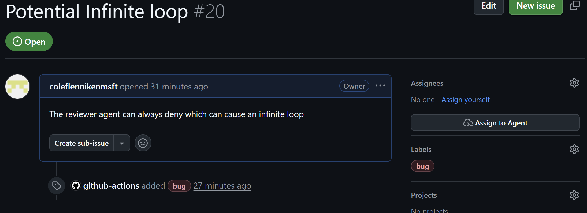

# Auto-Triage Issues Agentic Workflow

Automatically labels new or edited GitHub issues to improve triage speed and backlog quality.

Built for GitHub Agentic Workflows (GH-AW): Markdown workflow + frontmatter, compiled to GitHub Actions, and constrained by safe outputs.

Reference: https://github.github.com/gh-aw/setup/quick-start/

## Complexity
- **Low**: Simple classification rules based on rules. No multi-agent dispatch. Natural language customization is possible to easily augment labels and rules.

## Why This Is Valuable

- Reduces repetitive manual triage work
- Improves discoverability with consistent labeling
- Speeds routing to the right maintainers
- Keeps automation low-risk with guarded label operations

## What It Does

On issue opened/edited events, the agent:

1. Reads the triggering issue
2. Classifies content
3. Applies labels in one add-labels action
4. Uses needs-triage when confidence is low

Primary labels:

- bug
- enhancement
- documentation
- question
- needs-triage

## Example

Example of an issue after auto-triage labeling:

## Customization
- Adjust classification rules to fit your project's language and conventions
- Add more labels or refine criteria as needed
- Depending on label output, additional agents could be triggered for further automation (e.g. investigating bug reports, routing feature requests)
- Addition triggers could be added to triage issues created prior to this workflow's deployment, or on a schedule for ongoing maintenance.
