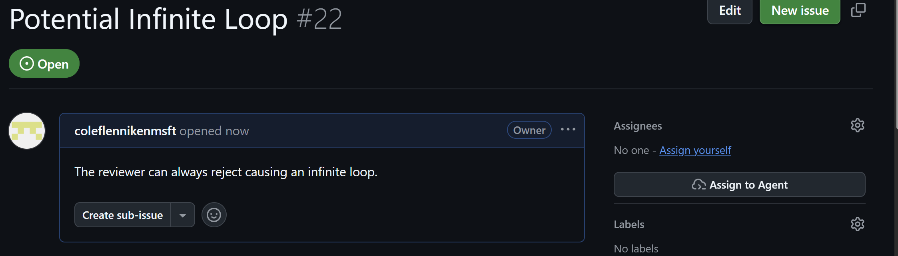
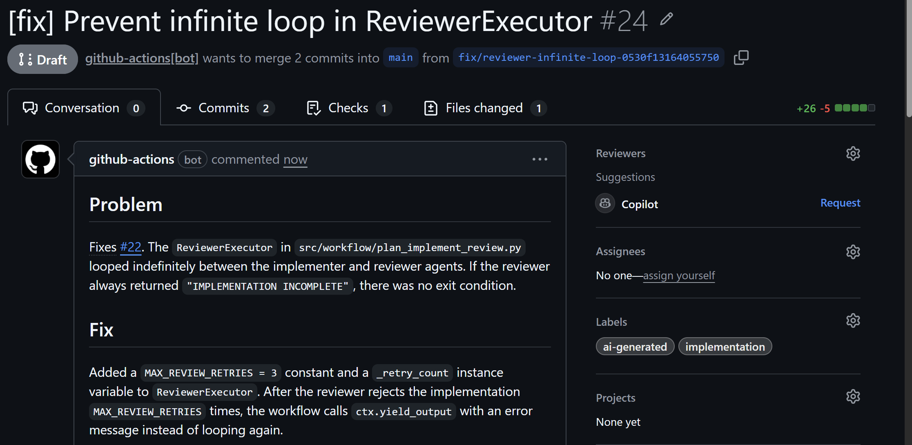
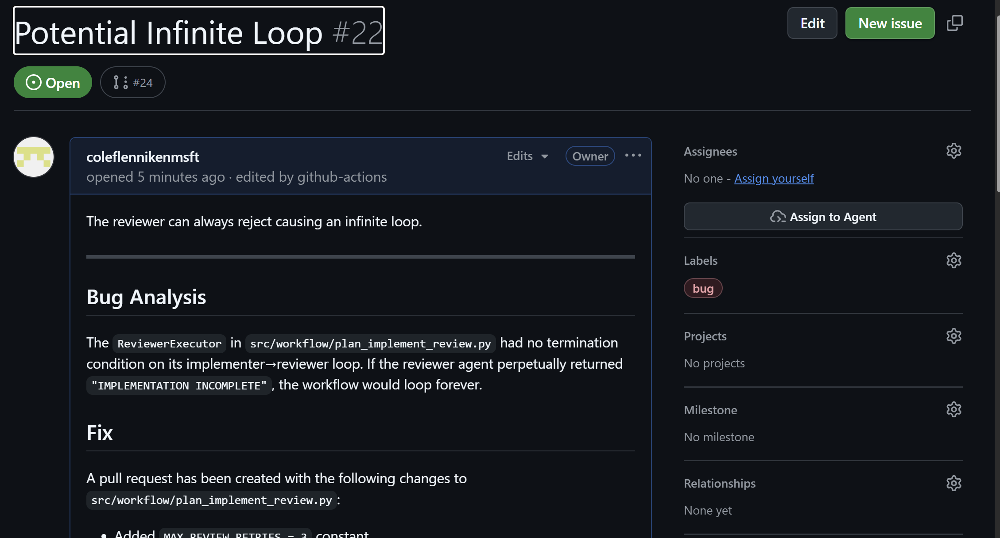

# Bug-Fix Agentic Workflow

Attempts to reproduce and fix reported bugs from GitHub issues, then opens a pull request with the proposed change when confidence is high.

## Complexity
- **Low**: Requires issue analysis, codebase investigation, targeted code changes, and pull request creation. The workflow is still bounded by explicit safe outputs and a narrow trigger. Little to no customization is needed to apply this pattern to other repositories.

## Why This Is Valuable

- Reduces time-to-first-fix for straightforward bugs
- Automates repetitive investigation and patch creation
- Produces reviewable pull requests instead of making direct changes on the default branch
- Keeps escalation paths clear by routing uncertain cases back to humans

## What It Does

When the `bug` label command is used, the agent:

1. Reads the triggering issue
2. Analyzes the codebase for likely root causes
3. Implements a high-confidence fix when possible
4. Creates a pull request with the proposed change
5. Falls back to human review when confidence is too low

Primary safe outputs:

- update-issue
- create-pull-request

Default pull request behavior:

- Title prefix: `[fix] `
- Labels: `bug`, `ai-generated`

## Example
### When an issue is labeled with "bug", the agent begins analysis

### If a fix is implemented, a pull request is created with the change

### A summary of the changes (or reason for not changing) is added to the issue comments

## Customization
- Change the `label_command` trigger if you want a different invocation pattern
- Tighten or expand the instructions for what counts as a high-confidence fix
- Add repository-specific expectations for tests, logging, or documentation updates
- Adjust pull request labels and title prefix to match your contribution workflow
- Add escalation guidance for cases that should always go to a human instead of automation
- Add context to the prompt about the codebase structure, testing framework, or common bug patterns to improve fix quality
