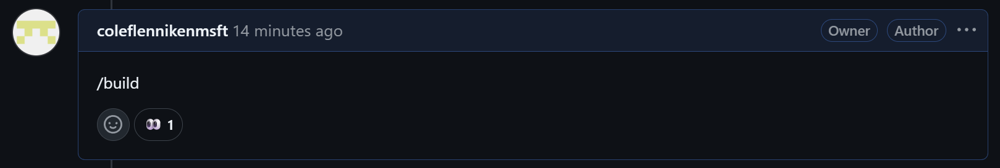
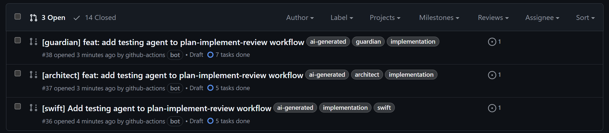
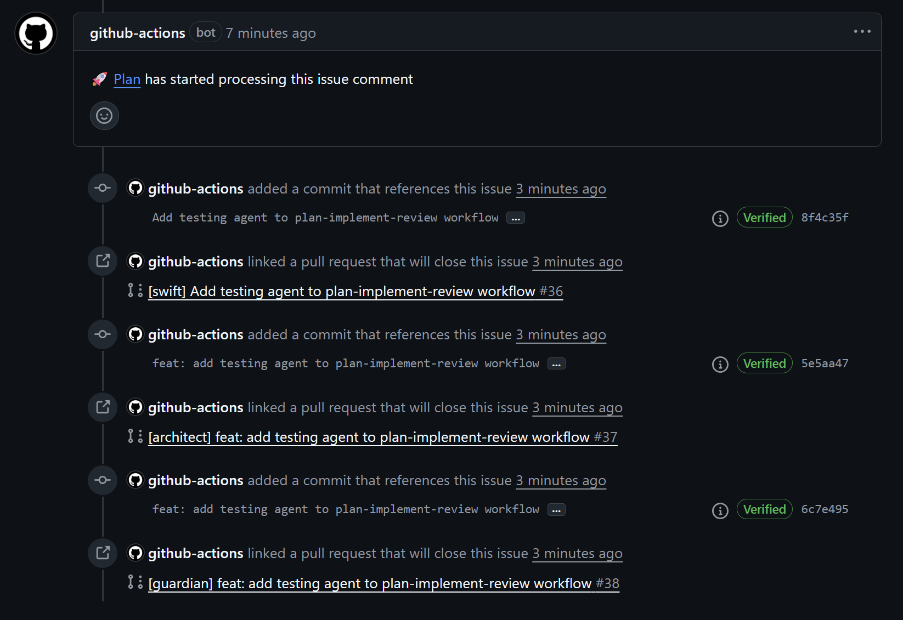
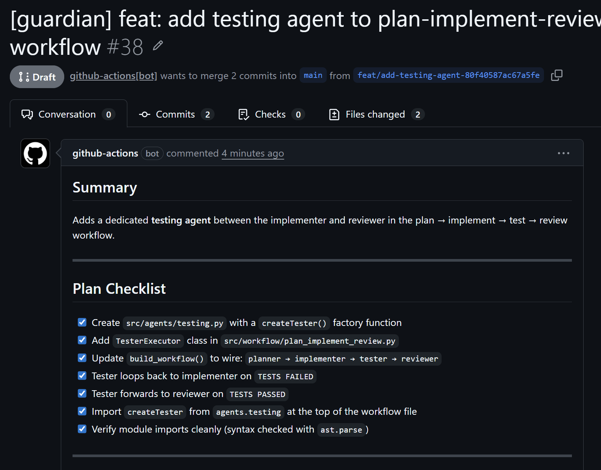

# Parallel Prototype Agentic Workflow

Dispatches three independent AI agents, each with a distinct implementation philosophy, to build competing prototypes from the same plan, enabling side-by-side comparison of approaches.

Built for GitHub Agentic Workflows (GH-AW): Markdown workflow + frontmatter, compiled to GitHub Actions, and constrained by safe outputs.

Reference: https://github.github.com/gh-aw/setup/quick-start/

## Complexity
- **High**: Multi-agent orchestration with a planner dispatching three parallel worker workflows. Requires coordination via `dispatch-workflow`, issue tracking for plan visibility, and distinct persona prompts to produce meaningfully different outputs. Significant prompt customization needed to ensure each persona properly embodies its philosophy while still delivering a viable prototype.

## Why This Is Valuable

- Generates multiple implementation approaches for the same requirement in parallel
- Enables objective comparison of trade-offs (clean design vs. security vs. speed)
- Reduces decision paralysis by producing concrete prototypes instead of abstract debates
- Surfaces hidden requirements through divergent implementations
- Lets reviewers cherry-pick the best ideas from each approach

## How It Works

A `/build` slash command on an issue triggers the orchestrator, which:

1. Reads and analyzes the issue specification
2. Creates a structured implementation plan
3. Appends the plan to the issue body for visibility
4. Dispatches three worker workflows in parallel, each receiving the same plan

### The Personas

| Persona | File | Philosophy | When ambiguous, chooses... |
|---|---|---|---|
| **The Architect** | `architect.md` | Clean design, clear abstractions, extensibility | The cleanest architecture |
| **The Guardian** | `guardian.md` | Security, input validation, defensive coding | The more defensive option |
| **The Swift** | `swift.md` | Speed, pragmatism, minimal moving parts | The simpler interpretation |

Each persona creates its own pull request with the `[architect]`, `[guardian]`, or `[swift]` prefix, making it easy to compare the three approaches side by side.

### Workflow Architecture

```
Issue (/build command)
  └─▶ Plan (orchestrator)
        ├─▶ dispatch: guardian
        ├─▶ dispatch: architect
        └─▶ dispatch: swift
              ↓         ↓         ↓
           PR #1      PR #2      PR #3
```

## Example

### A `/build` command on an issue triggers the planner


### Three PRs arrive from the competing personas





## Files

| File | Role |
|---|---|
| `plan.md` | Orchestrator — analyzes situation, creates plan, dispatches workers |
| `architect.md` | Worker — implements with focus on clean design and abstractions |
| `guardian.md` | Worker — implements with focus on security and defensive coding |
| `swift.md` | Worker — implements with focus on speed and pragmatism |

## Customization
- Add or remove personas to match your team's evaluation criteria (e.g., a "Cost" persona focused on resource efficiency)
- Adjust the plan structure in `plan.md` to include domain-specific sections (API contracts, database schemas, etc.)
- Tune each persona's philosophy and guidelines to reflect your organization's priorities
- Change the slash command name from `/build` to match your team's conventions or change the trigger to a different event (e.g., issue labeled "prototype")
- Add `engine: { model: ... }` to each worker to pin specific AI models per persona
- Extend the planner to update a GitHub Project board for tracking prototype progress

## Operational Notes
- The planner runs with read-only permissions and uses `safe-outputs` for all write operations
- Worker workflows are triggered via `dispatch-workflow` and run independently
- Each worker creates a draft pull request, keeping the default branch clean
- Issue content is treated as untrusted input — the planner never executes code from the issue body